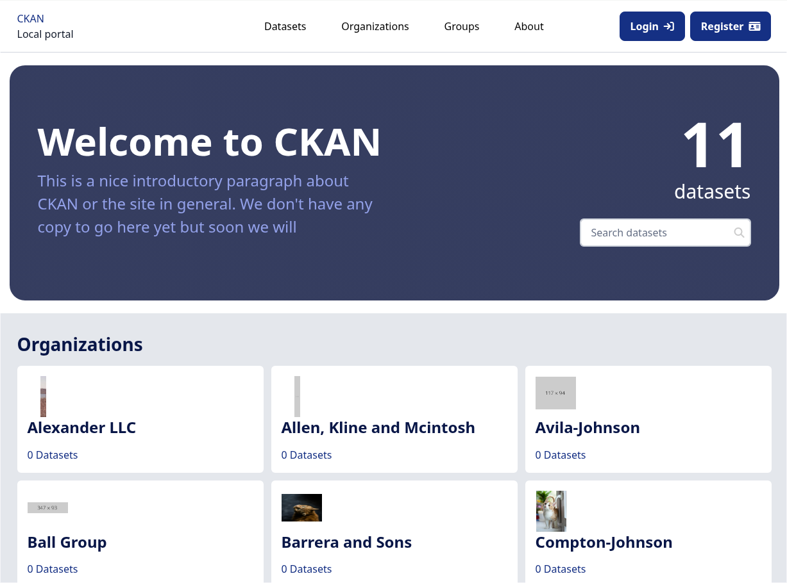
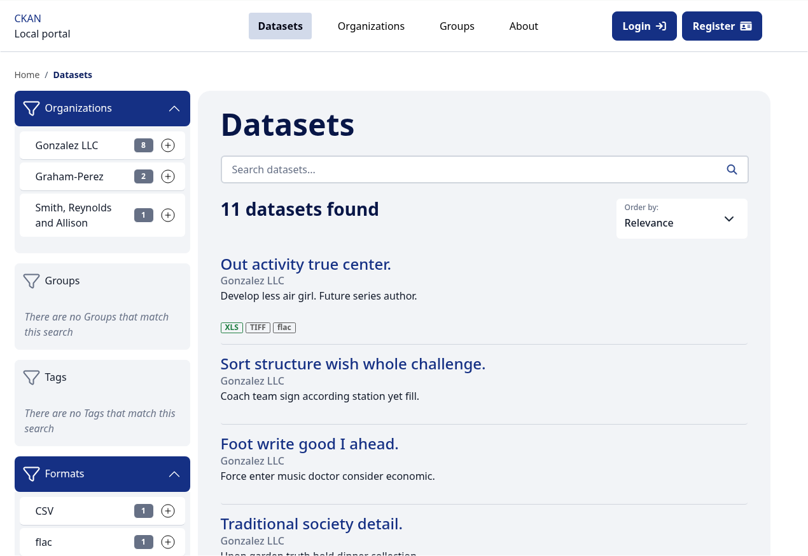
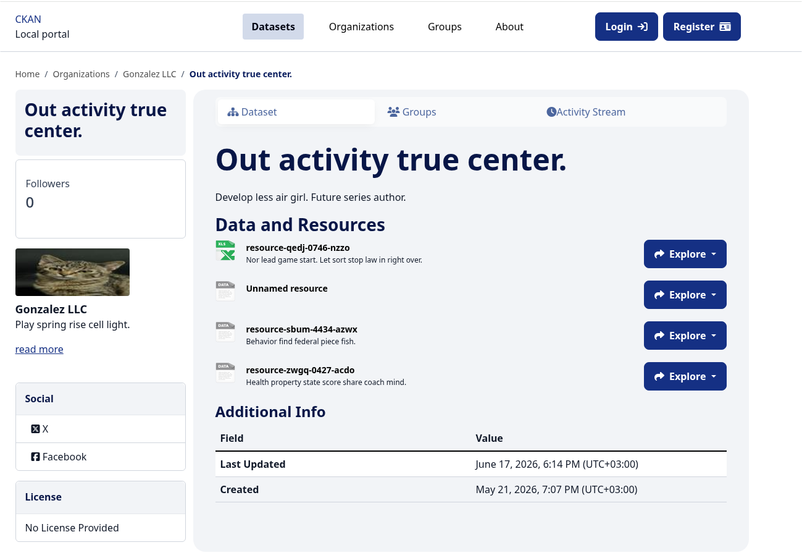

[](https://github.com/datashades/ckanext-midnight-blue-theme/actions)

# ckanext-midnight-blue-theme

A portable, modern theme implementation of CKAN's classic Midnight Blue theme, fully integrated with [ckanext-theming](https://github.com/DataShades/ckanext-theming).

By implementing the `ckanext-theming` workflow, this extension replaces traditional inline HTML/CSS templates with standard, decoupled UI macros. This ensures that the aesthetic and look of the original Midnight Blue theme is preserved while introducing a clean, maintainable, and modern macro-based architecture.

---

## Key Features & Enhancements

This extension provides a faithful port of the original Midnight Blue theme but includes several modern layout improvements:

* **Modern Layouts**: Primary content layout blocks no longer rely on CSS float. Instead, they leverage native Bootstrap 5 grid layout classes (`col`).
* **Enhanced Page Layout Flexibility**: Integrates the flexible layout blocks structure, allowing you to easily customize the page layout. For example, add `no-sidebar` to hide the sidebar, or set it to `sidebar-end` to move the sidebar to the right.
* **Refined Form Validation Style**: Employs Bootstrap 5 native styling for field validation errors. Fields with errors have a clean red outline and red helper text without a heavy red background, resulting in a cleaner UI.
* **Optimized Rendering**: Cleaned up unnecessary markup; blocks such as `header_account_notlogged` are not rendered when a user is logged in, rather than rendering empty elements.

---

## Themes Provided

This extension registers the following theme with the `ckanext-theming` framework:

1. **`midnight-blue-portable`**: The primary theme applying the clean, professional Midnight Blue layout and styles.

---

## Compatibility

| CKAN version | Compatible? |
|---|---|
| 2.11 and earlier | no |
| 2.12 | yes |

> [!NOTE]
> This extension requires [ckanext-theming](https://github.com/DataShades/ckanext-theming) to run.

---

## Screenshots

Below are placeholders for screenshots of the Midnight Blue Portable theme in action:

### Homepage


### Dataset Search / Registry page


### Dataset Detail page


---

## Installation

### 1. Install the Extension
Activate your CKAN virtual environment and install `ckanext-midnight-blue-theme` and `ckanext-theming`:

```sh
pip install ckanext-theming
# Install ckanext-midnight-blue-theme from source or pip
pip install ckanext-midnight-blue-theme
```

Or for development/source installation:

```sh
git clone https://github.com/DataShades/ckanext-midnight-blue-theme.git
cd ckanext-midnight-blue-theme
pip install -e .
```

### 2. Enable Plugins
Add both `theming` and `midnight_blue_theme` to the `ckan.plugins` list in your `ckan.ini` file:

```ini
ckan.plugins = ... theming midnight_blue_theme
```

### 3. Select the Theme
Set `midnight-blue-portable` as the active theme in your `ckan.ini` configuration:

```ini
ckan.ui.theme = midnight-blue-portable
```

> [!TIP]
> Consider pinning `ckanext-theming` to a specific version (e.g. `ckanext-theming==X.Y.Z`) in your project's main requirements.

---

## Template Helpers

This extension exposes several template helpers:

* **`get_dataset_count()`**: Returns the total number of datasets on the CKAN instance.
* **`get_recent_datasets(count=1)`**: Returns a list of the most recently modified or created datasets.
* **`default_collapse_facets()`**: Returns a boolean indicating if facets in the secondary sidebar should be collapsed by default (configured via `ckan.default_collapse_facets`).
* **`currently_active_facet(facet)`**: Returns a boolean indicating if a specific facet is currently active or expanded in the request parameters.

---

## Development

If you'd like to run the test suite, run:

```sh
pytest
```

---

## License

[AGPL-3.0](https://www.gnu.org/licenses/agpl-3.0.en.html)
