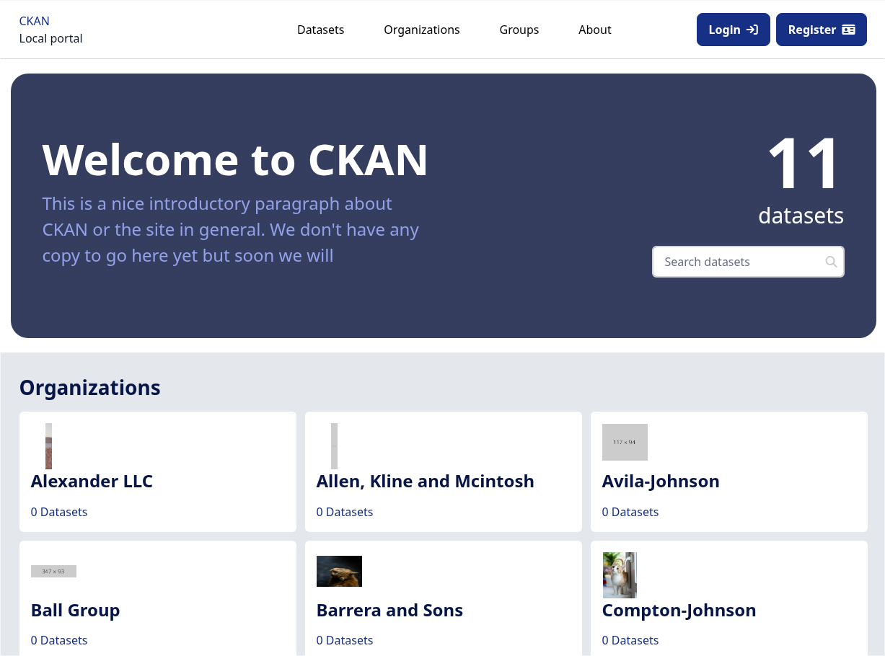
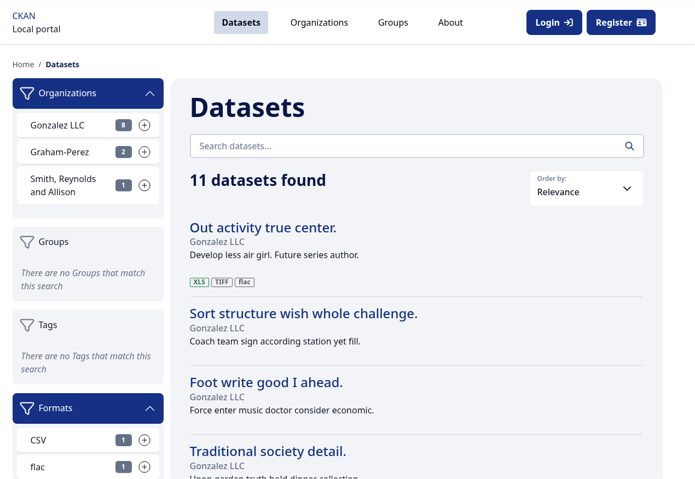
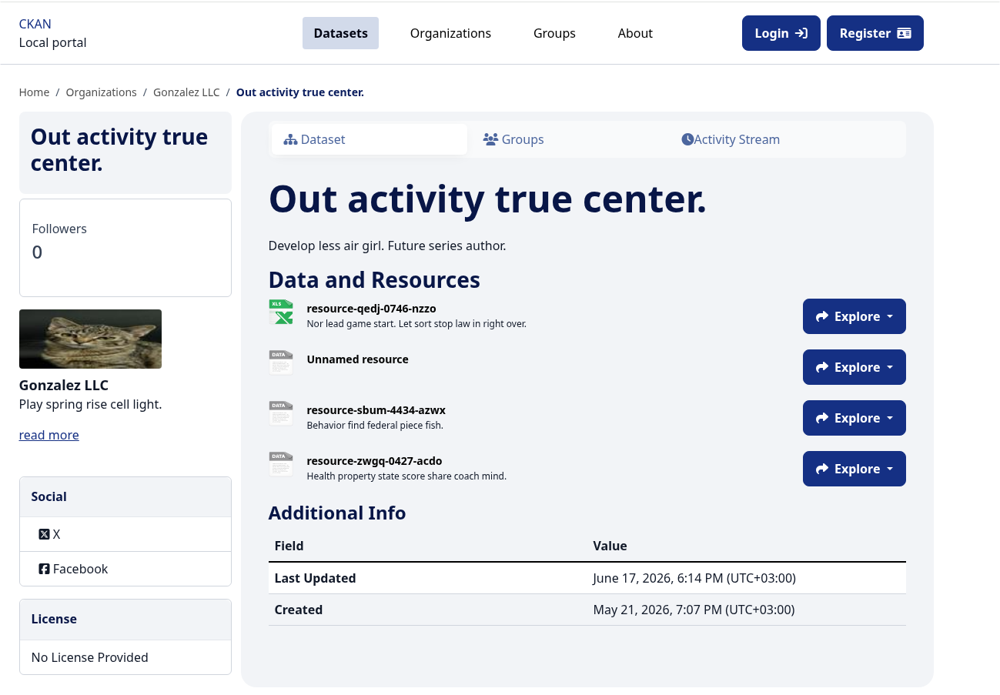

[](https://github.com/datashades/ckanext-midnight-blue-theme/actions)

# ckanext-midnight-blue-theme

A portable, modern theme implementation of CKAN's classic Midnight Blue theme,
fully integrated with
[ckanext-theming](https://github.com/DataShades/ckanext-theming).

By implementing the `ckanext-theming` workflow, this extension replaces
traditional inline HTML/CSS templates with standard, decoupled UI macros. This
ensures that the aesthetic and look of the original Midnight Blue theme is
preserved while introducing a clean, maintainable, and modern macro-based
architecture.

---

## Differences from core theme

This extension provides a faithful port of the original Midnight Blue theme but
includes several modern layout improvements:

* Primary content layout blocks no longer rely on CSS float. Instead, they
  leverage native Bootstrap 5 grid layout classes (`col`).
* Integrates the flexible layout blocks structure, allowing you to easily
  customize the page layout. For example, add `no-sidebar` to hide the sidebar, or set it to `sidebar-end`
  to move the sidebar to the right.
* Employs Bootstrap 5 native styling for field validation errors. Fields with
  errors have a clean red outline and red helper text without a heavy red
  background.
* Cleaned up unnecessary markup; blocks such as `header_account_notlogged` are
  not rendered when a user is logged in, rather than rendering empty elements.

---

## Themes Provided

This extension registers the following theme with the `ckanext-theming`
framework:

1. **`midnight-blue-portable`**: The primary theme applying the Midnight Blue layout and styles.

---

## Compatibility

| CKAN version     | Compatible?          |
|------------------|----------------------|
| 2.11 and earlier | no (missing helpers) |
| 2.12             | yes                  |

---

## Screenshots

### Homepage


### Dataset Search / Registry page


### Dataset Detail page


---

## Installation

### 1. Install the Extension

Activate your CKAN virtual environment and install `ckanext-midnight-blue-theme`:

```sh
pip install ckanext-midnight-blue-theme
```

Or for development/source installation:

```sh
git clone https://github.com/DataShades/ckanext-midnight-blue-theme.git
cd ckanext-midnight-blue-theme
pip install -e .
```

### 2. Enable Plugins
Add `midnight_blue_theme` to the `ckan.plugins` list in your `ckan.ini` file:

```ini
ckan.plugins = ... midnight_blue_theme
```

### 3. Select the Theme
Set `midnight-blue-portable` as the active theme in your `ckan.ini` configuration:

```ini
ckan.ui.theme = midnight-blue-portable
```

---

## Development

If you'd like to run the test suite, run:

```sh
pytest
```

---

## License

[AGPL-3.0](https://www.gnu.org/licenses/agpl-3.0.en.html)
